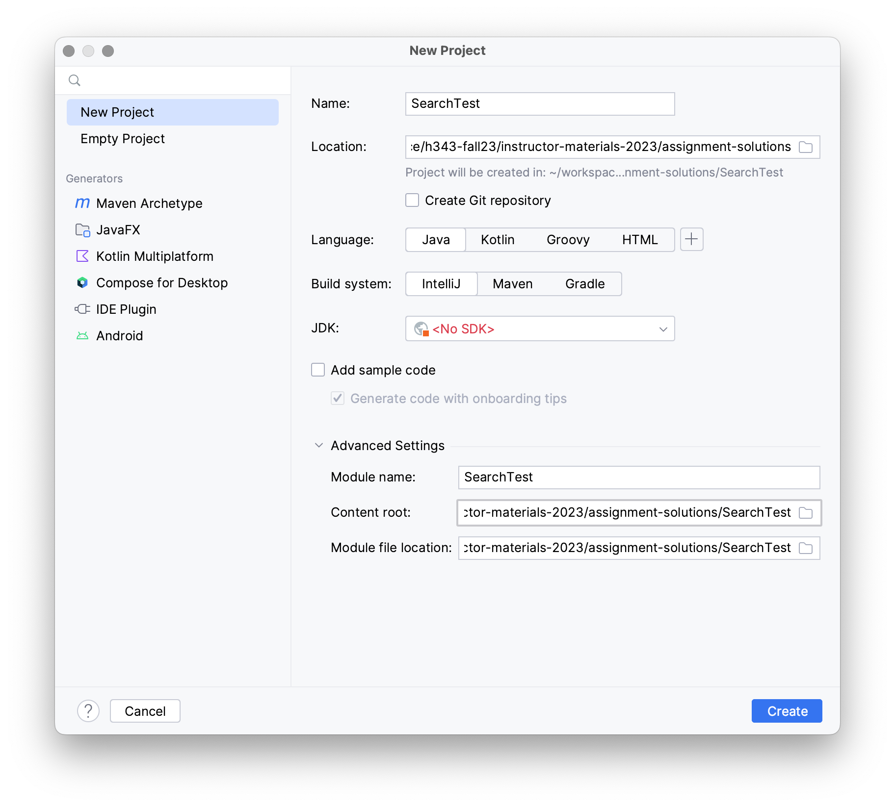
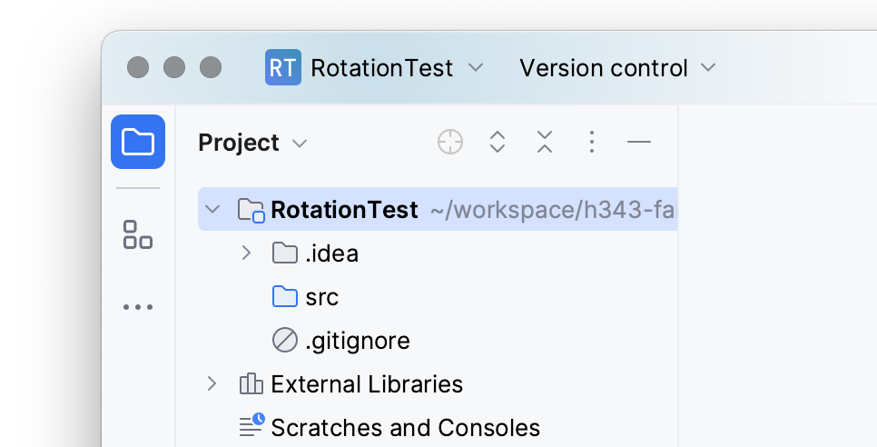

# Lab 1: Array Search Testing

## Table of contents

1. [Software installation and environment set-up](#software-installation-and-environment-set-up)
2. [Instructor demonstration: testing and debugging array rotation](#instructor-demonstration-testing-and-debugging-array-rotation)
3. [**Your assignment:** testing search algorithms](#your-assignment-testing-search-algorithms)

## Software installation and environment set-up

+ Download and install [IntelliJ IDEA](https://www.jetbrains.com/idea/download) Community Edition
  - Alternatively you can use a package manager such as Homebrew: `brew install intellij-idea-ce`
  - Software like IntelliJ is often referred to as
    [IDE](https://en.wikipedia.org/wiki/Integrated_development_environment)s, 
    because they integrate a code editor, build tools and a debugger.

+ Launch the IntelliJ IDE
  - In the welcome window, click "New Project". A new project should be created for each lab.
  - In the pop-up window, enter the title of your lab assignment as "Name".
    For lab 1, it should be `SearchTest` .
  - Choose "Location", which is whatever directory that you prefer to contain
    all lab assignments. Check "Create Git repository" if you would like to use
    version control (optional).
  - Language: "Java"; build systems: "IntelliJ"
  - Install JDK. Click "Add SDK -> Download JDK" in the "JDK" drop-down menu
    
  - In the pop-up window choose "Vendor" : "Oracle OpenJDK". "Version" should
    be filled in automatically (`20` as of the time of writing).
    Make sure version ≥15. "Location" can be left as default.
    
  - Click "Download" and wait for the download to finish. In the "New Project"
    window, uncheck "Add sample code" and leave everything else as is. Click "Create".

## Instructor demonstration: testing and debugging array rotation

In this section I will show you how to:

- Structure your lab projects
- Build and run the code
- Debug and test

We first create a IntelliJ project "RotationTest". After creation, the file structure looks like:


Suppose we are to implement the "ripple" approach of array rotation. We right click on the
`src` directory in the file structure and choose **"Java Class"**.


We enter "Rotation" as its name. IntelliJ creates a new file `src/Rotation.java` whose
content is an empty `public class Rotation`. In the editor, we create `rotate_ripple`
as a public static member function of `Rotation`:

```java
public class Rotation {
    public static void rotate_ripple(int[] A) {
        if (A.length > 1) {
            int tmp1 = A[0];
            for (int i=0; i != A.length - 1; ++i) {
                int tmp2 = A[i+1];
                A[i+1] = tmp1;
                tmp1 = tmp2;
            }
            A[0] = tmp1;
        }
    }
}
```

Next we create unit tests for `rotate_ripple`. Right click on the root
directory and select "New -> Directory". Name the new directory `test`.


Right click on `test` in the file structure. Go to the last item in the pop-up menu
and select "Mark Directory As -> Test **Sources** Root". The `test` directory will be
highlighted in green.

Add a new Java class in `test` called `RotationTest`. Create `rotate_save_n_shift`
as a private static member function of `RotationTest`. We use `rotate_save_n_shift`
as our [test oracle](https://en.wikipedia.org/wiki/Test_oracle).

>  A test oracle is a mechanism for determining whether a test has passed or failed.

In this case, we are testing `rotate_ripple` against `rotate_save_n_shift`.

Next we import [JUnit](https://junit.org), a Java testing framework. Add the following
lines to the beginning of `RotationTest`:

```java
import org.junit.jupiter.api.Test;
import static org.junit.jupiter.api.Assertions.*;
```

Move cursor to `junit`, where IntelliJ tells me that it cannot resolve the symbol.
Click on "Add 'JUnit' to classpath" and then "OK". Perform the same action on `jupiter`.


Add the following as a public member function of `RotationTest`:

```java
    @Test
    public void test_rotation_simple() {
        String test_description = "rotating a small array";
        int[] A = {1, 2, 3, 4, 5};
        int[] B = {1, 2, 3, 4, 5};
        rotate_save_n_shift(A);
        Rotation.rotate_ripple(B);
        try {
            assertArrayEquals(A, B);
        } catch (Exception e) {
            fail(test_description + e.toString());
        }
    }
```

Note that the function is marked with the `@Test` attribute, which indicates
that it contains a unit test.
The array `{1, 2, 3, 4, 5}` is the example that we talked about in lecture.
We call the two implementations of rotation and compare the produced arrays
using `assertArrayEquals`, which is wrapped in a try-catch block. Should the
assertion fail, the catch clause throws an exception, which contains an error
message that consists of description of the test case and the exception `e`.

We can run this test point by clicking on the green icon:


The rotation implementation is correct, so the test case passes:


We can also generate random numbers to fill the input array:

```java
@Test
public void test_rotation_random() {
    String test_description = "rotating an array with random integers";
    Random r = new Random(0);
    int[] A = new int[100];
    for (int i = 0; i != A.length; ++ i) {
        A[i] = r.nextInt();
    }
    int[] B = Arrays.copyOf(A, A.length);
    rotate_save_n_shift(A);
    Rotation.rotate_ripple(B);
    try {
        assertArrayEquals(A, B);
    } catch (Exception e) {
        fail(test_description + e.toString());
    }
}
```

Now that we have multiple test cases, we can select which tests to run
using the drop-down menu in the top-right corner:


Suppose I made a mistake in the implementation. For example, if I did not assign `tmp2`
to `tmp1`, it would cause the entire array to be filled with `A[0]` and produce a wrong
answer. If we remove `tmp1 = tmp2` and rerun the test, it catches the bug by throwing
an assertion error:


Now suppose we would like to debug the issue. We start by inspecting the two rotated arrays.
We can add a breakpoint at `assertArrayEquals(A, B)`. We click on the line number and
it turns into a red dot. Then we choose "Debug ..." from the drop-down menu:


Execution stops at the breakpoint. Both arrays, `A` and `B`, are displayed in the "Debug"
section of IntelliJ. We can see that the correct implementation produces `{5, 1, 2, 3, 4}` but
the buggy implementation produces `{1, 1, 1, 1, 1}` instead:


We can add more breakpoints by repeating the steps above. Breakpoints are controlled
using the "View Breakpoints" pop-up (the two-overlapping-red-circles button).
We can resume the execution by hitting the green play button ("Resume Program").
Alternatively, we can single-step through the program by pressing the down-arrow button.

## Your assignment: testing search algorithms

### Overview

Your tasks are to create test cases for three search algorithm implementations.
You have two options for test oracles: 1) using the Java standard library
2) implementing your own.

Think about the following questions before you start:

1. What does it mean for each search algorithm to be correct?
2. Can some of the three algorithms share the same test oracle? Why?
3. What are possible _corner cases_? Hint: arrays with 0 or 1 element, arrays
   with even or odd lengths, start and end positions being equal, ...

### Submission

Submit your test file named `StudentTest.java`. The file should contain
`public class StudentTest`. The class contains a member function
`public void test()` (marked with `@Test`) which serves as the main entrance.

For example, if you have 2 test functions `test_foo()` and `test_bar()`,
the `test()` function should be:

```java
@Test
public void test() {
    test_foo();
    test_bar();
}
```

Inside each test function, use JUnit's
[assertions](https://junit.org/junit5/docs/5.0.1/api/org/junit/jupiter/api/Assertions.html)
such as `assertEquals` to check for the correct answer. Suppose you are testing
`Search.find_first_true(A, begin, end)` and the expected result is `2`:

```java
import org.junit.jupiter.api.Test;
import org.junit.jupiter.api.BeforeEach;
import static org.junit.jupiter.api.Assertions.*;

public class SearchTest {
	@Test
	public void test_find_first_true() {
		// ...
        assertEquals(2, Search.find_first_true(A, begin, end));
	}
}
```

Autograder will run your submission on 8 problematic `Search` implementations and
one correct implementation to rule out false positive. Your test cases are expected
to throw exceptions on all implementations except the correct one.

### Problem Set

#### Problem 1: Testing Linear Search on an Array of Booleans

The most basic but surprisingly useful search function involves an
array `A` of boolean values (`true` or `false`). The function finds
the position of the first `true`, that is, find the smallest index `i`
such that `A[i]` is `true`.
The search is restricted to the subarray within `A` that starts at the `begin`
index and finishes one element before the `end` index.
(This is called a half-open interval.) If there are no `true` elements in the
subarray, then `find_first_true` returns the `end` position of the
subarray.

**[Example 1]** If the input array `A` is

```java
{false, false, true, false, true}
```

then the result should be 2 because `A[2] == true` and there are no
`true` elements at lower indices (`A[0]` and `A[1]` are both `false`).

**[Example 2]** Suppose `A` is the array

```java
{true, false, true, false, true}
```

and we search in the half-open interval `[1,3)`. The answer should be `2`.

```java
find_first_true(A, 1, 3) == 2
```

The search function has the following signature:

```java
public static int find_first_true(boolean[] A, int begin, int end) {
    // ...
}
```

Add test cases for function `Search.find_first_true(A, begin, end)`
in the `StudentTest` class and call your tests in `test()`.

#### Problem 2: Linear Search on an Array of Integers

Another search function involves an array of integers, with the goal
of finding the position of the first element that is equal to the `x` parameter.
If there are no elements equal to `x`, the length of the array is returned.

**[Example 3]** Suppose `A` is the array

```java
{32, 11, 4, 5, 99, 5, 32, 75}
```
then the result of search for `5` should be `3`:

```java
find_first_equal(A, 5) == 3
```

The search function has the following signature:

``` java
public static int find_first_equal(int[] A, int x) {
    // ...
}
```

Add test cases for function `Search.find_first_equal(A, x)` in the `StudentTest`
class and call your tests in `test()`.
The implementation of `find_first_equal` could potentially depend on `find_first_true`.

#### Problem 3: Testing Binary Search on an Array of Booleans

We revisit searching an array of Booleans, but suppose that all of the
`false` elements in the array come before all of the `true` elements (sorted) this time.
A more efficient solution that runs in time proportional to the logarithm of
the length of the array looks at the element in the middle and then restricts
the search to the right or left subarray depending on its value.

**[Example 4]** Suppose `A` is the sorted array

```java
{false, false, true, true, true, true, true}
```

The position of the first `true` element is `2` in this case.

The search function has the following signature:

```java
public static int find_first_true_sorted(boolean[] A, int begin, int end) {
    // ...
}
```

Add test cases for function `Search.find_first_true_sorted(A, begin, end)` 
in the `StudentTest` class and call your tests in `test()`.

-----------------

* You have reached the end of Lab 1. Yay!
