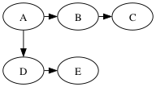
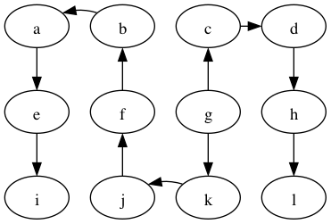
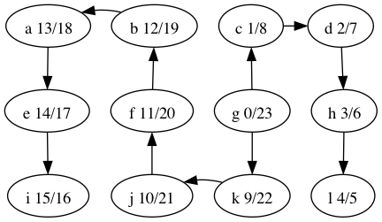
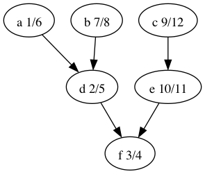

# Lecture: Graphs, Breadth and Depth-first Search

The standard mathematical way to represent a **graph** G is with a set
of vertices V and a set of edges E, that is, G = (V,E).

In a **directed graph**, each edge is a pair of vertices where the first
vertex is called the source and the second is the target.

In an **undirected graph**, each edge is a set containing two distinct
vertices.
    
I often use n for the number of vertices and m for the number of
edges.

The following is an example of a directed graph.

The set of vertices for this graph is 

    {0,1,2,3,4,5}.

The set of edges is 

    {(0,0), (1,2),(1,4),  (2,5),  (3,5),(3,0),  (4,2),  (5,4),  }.

The following is an undirected graph.

The set of vertices is `{0,1,2,3,4}`.

The set of edges is `{ {1,2},{1,0},  {2,3},{2,4},{2,0},  {3,4},  {4,0} }`.

We often writes an undirected edge as `(1,2)` or `1-2` instead of `{1,2}`.

## Adjacency List

The **Adjacency List** representation of a graph is an array of linked
lists.

Example: for the above directed graph the adjacency list
representation is

     |0| -> 0
     |1| -> 2 -> 4
     |2| -> 5
     |3| -> 0 -> 5
     |4| -> 2
     |5| -> 4

Example: for the above undirected graph the adjacency list
representation is

     |0| -> 1 -> 2 -> 4
     |1| -> 0 -> 2
     |2| -> 1 -> 4 -> 3 -> 0
     |3| -> 2 -> 4
     |4| -> 0 -> 3 -> 2

(Each edge is stored twice.)

Adjacency lists are good for storing sparse graphs.

* Space: O(n + m).
* Edge detection given two vertices: O(n)
* Edge insert: O(1)
* Edge removal given two vertices: O(n) 
* Edge remove given edge handle: O(1) if use double linked
* Edge removal: O(n) or O(1) if use double linked and edge handle
* Vertex insert: amortized O(1)
* Vertex delete: not easily supported

## Adjacency Matrix

The **Adjacency Matrix** representation of a graph is a Boolean matrix.

Example, for the directed graph above.

      0 1 2 3 4 5
    0 1 0 0 0 0 0
    1 0 0 1 0 1 0
    2 0 0 0 0 0 1
    3 1 0 0 0 0 1
    4 0 0 1 0 0 0
    5 0 0 0 0 1 0

Example, for the undirected graph above.

      0 1 2 3 4
    0 0 1 1 0 1
    1 1 0 1 0 0
    2 1 1 0 1 1
    3 0 0 1 0 1
    4 1 0 1 1 0

Note that the matrix is symmetric.

Adjacency matrices are good for dense graphs.

* Space: O(n²)
* Edge detection given two vertices: O(1)
* Edge insert: O(1)
* Edge removal given two vertices: O(1)
* Edge remove given edge handle: O(1)
* Edge removal: O(1)
* Vertex insert: amortized O(1)
* Vertex delete: not easily supported

How could we represent Adjacency Matrices in Java?

# Breadth-First Search

Def. a **path** is a sequence of edges such that the target of
each edge matches the source of the next edge in the sequence.
We sometimes abbreviate a path to v₀ ⇒ vₖ, where v₀ is the source
of the first edge and vₖ is the target of the last edge.
We write v₀ ⇒ᵏ vₖ when the length of the path is important.
Also, when talking about multiple different paths, we might
use a subscript to give the path a name, such as 
v₀) ⇒ₓ vₖ.

Problem: compute the shortest paths from vertex g to all other
vertices in the graph.

Example: what is a shortest path from g to f?

Possible solution: g → k → j → f, length 3.

To prove this is really the shortest, we need to make sure
there are no paths of length less-than 3 from g to f.

How do we prove that? Well, look at all paths of length less-than 3
that start from g.

Length 0 paths:

    g

Length 1 paths:

	g → c

	g → k

Length 2 paths:

	g → c → d

	g → k → l

	g → k → j

Good, none of the paths from g with length less-than 3 reach f.

So indeed, g → k → j → f is the shortest path from g to f.

## BFS Algorithm

Towards a general algorithm for BFS, can we compute all the k+1 length
shortests paths given all the k-length shortest paths?

Draw a picture of the wave-front of the k-length shortest paths and
the out-edges on the wave-front.

High-level Algorithm:

	for k = 0...n
	  for each path s ⇒ᵏ u:
		for each edge {u,v} incident to u:
		  If we don't already have a shortest-path to v, 
		  then s ⇒ᵏ⁺¹ u is a shortest path from s to v.

What data structures should we use?

* The shortest paths form a *tree*:
  for each vertex v, store the previous vertex u in its shortest path.
  we call u the "parent" of v because u is the parent of v in
  the tree of shortest paths. This is also called the 
  **breadth-first tree**.

* For the paths of length k:
  We just need the end vertex of each path, so let's maintain a bag
  of the vertices at the ends of the paths of length k.

* To make sure we ignore vertices that have already been encountered,
  we use an array called `done` that maps vertex numbers to True/False.

Version 1 of the algorithm

	static <V> void
    bfs_v1(Graph<V> G, V start, Map<V,Boolean> visited, Map<V,V> parent) {
		for (V v : G.vertices())
			visited.put(v, false);
		int k = 0;
		ArrayList<V> ends = new ArrayList<V>();
		ends.add(start);
		parent.put(start, start);
		visited.put(start, true);
		while (k != G.num_vertices()) {
			ArrayList<V> new_ends = new ArrayList<V>();
			for (V u : ends) 
				for (V v : G.adjacent(u))
					if (! visited.get(v)) {
						parent.put(v, u);
						new_ends.add(v);
						visited.put(v, true);
					}
			ends = new_ends;
			++k;
		}
	}

Some observations about version 1

* If the `new_ends` is empty at the end of the loop body,
  then we can stop early.

* The `ends` and `new_ends` can be combined into a single
  data structure if we use a queue instead of two bags.

	The front part of the queue represents `ends`
	and the back part of the queue represents `new_ends`.

	With this change, we can simplify the code by combining
	the `while k` and the `for u` loops into a single loop
	that checks whether the queue is non-empty.

Final version of breadth-first search 

	static <V> void
    bfs(Graph<V> G, V start, Map<V,Boolean> visited, Map<V,V> parent) {
		for (V v : G.vertices())
			visited.put(v, false);
		Queue<V> Q = new LinkedList<V>();
		Q.add(start);
		parent.put(start, start);
		visited.put(start, true);
		while (! Q.isEmpty()) {
			V u = Q.remove();
			for (V v : G.adjacent(u))
				if (! visited.get(v)) {
					parent.put(v, u);
					Q.add(v);
					visited.put(v, true);
				}
		}
	}

## Student group work

Example run of BFS version 2

	queue       parents
	[A]         P[A] = A
	[B,D]       P[B] = A, P[D] = A
	[D,C]       P[C] = B
	[C,E]       P[E] = D
	[E]
	[]

Time complexity of BFS

* Main loop: we traverse the entire adjacency list graph
  once and the combined length of the adjacency lists is O(m),
  so we have O(m) for the main loop. 
* Initialization: O(n) time and space for the parent and done arrays.
* Total: O(n + m)

# Depth-first Search

This search chooses to go deeper at each step, following an out-edge
from the current vertex to a never-before-seen vertex. If there are no
out-edges to never-before-seen vertices, then the search backtracks to
the last visited vertex with out-edges to never-before-seen vertices
and continues from there.

Show DFS on the following graph, starting at g:

Similar to BFS, DFS traverses a tree, a **depth-first tree**:

For generic search problems, that is, looking for a vertex with
a particular property, DFS and BFS both are good choices.

- BFS may require more storage if the graph has many high degree
  vertices because the queue gets big. 
- On the other hand, if the graph contains long paths, then DFS
  will use a lot of storage for it's stack.
- If there are infinitely long paths in the graph, then DFS
  may not be a good choice.

## Student group work

Perform DFS on the following graph

Solutions (there are multiple depth-first trees)

Are any of the DFS trees the same as a BFS tree for this graph?
Why not?

## Edge Categories

We can categorizes the edges of the graph with respect to the depth-first 
tree in the following way:
- **tree edge**: an edge on the tree, e.g., g → c in the graph above.
- **back edge**: an edge that connects a descendent to an ancestor
  with respect to the tree, e.g., f → g.
- **forward edge**: an edge that connects an ancestor to a descendent
  wrt. the tree, e.g., f → e
- **cross edge**: all other edges, e.g., k → l.

A graph has a cycle if and only if there is a back edge.

The DFS algorithm can compute the categories if we use a color
scheme to mark the vertices instead of just using a `done` flag.
The colors are:
- white: the vertex has not been discovered
- gray: the vertex has been discovered, but some of its descendants
  have not yet been discovered
- black: the vertex and all of its descendants have been discovered

During DFS, when considering an out-edge of the current vertex, the edge
can be categorized as follows:
- the target vertex is white: this is a tree edge
- the target vertex is gray: this is a back edge
- the target vertex is black: this could either be a forward or cross edge

Do the DFS example again but with the white/gray/black colors.

## Discover and Finish Times

We can discover yet more structure of the graph if we record
timestamps on a vertex when it is discovered (turned from white to
gray) and when it is finished (turned from gray to black).

This is useful when constructing other algorithms that use DFS,
such as topological sort. Here are the discover/finish times
for the DFS tree we computed above, shown again below.

What's the relationship between topological ordering and depth-first
search?

Let's look at the depth-first forest and discover/finish
times of the makefile graph.

Here's the vertices ordered by finish time:
f,d,a,b,e,c.

That's the reverse of one of the topological orders:
c,e,b,a,d,f.

Why is that? A vertex is finished *after* every vertex that depends
on it is finished. That's the same as topological ordering
except we've swapped *before* for *after*.
