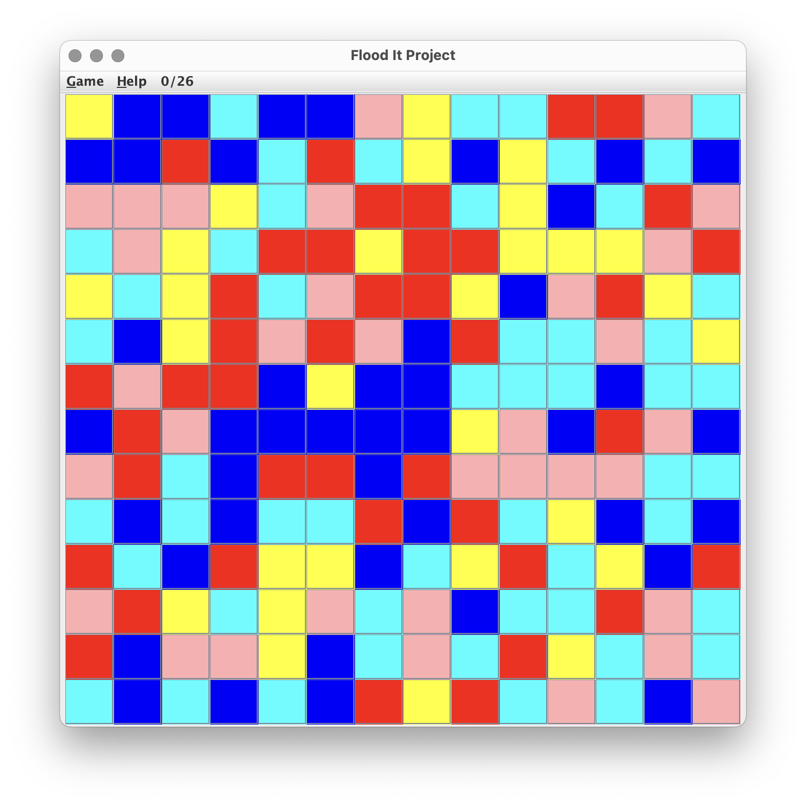

# Project 1: Flood It! 🌊

## The Game

“Flood It” is a tile coloring game played on a square board of colored tiles.

At each move, the player selects a color by clicking on one of the tiles.
The tile in the upper left corner, as well as all connected neighboring tiles of the same color,
are changed to the selected color. The objective of the game is end up with all the tiles
on the board being the same color while minimizing the number of moves.

If you haven’t played “Flood It” before, please spend some time playing the game
so that you can develop an intuition for how it works and formulate strategies
for game play before trying to implement anything. There is an [online version](http://unixpapa.com/floodit).

## Support Code and Submission

Don't worry! We have written most of the game
[here](https://github.com/IUDataStructuresCourse/flood-it-student-support-code).
The project has the following file structure:

```
.
├── FloodIt.iml
├── README
├── out
├── src
│   ├── Board.java
│   ├── Constants.java
│   ├── Coord.java
│   ├── Flood.java  (your code goes here)
│   ├── GUI.java
│   ├── Game.java
│   ├── Tile.java
│   ├── TimingGraph.java
│   └── WaterColor.java
├── test
│   └── FloodTest.java  (your tests goes here)
└── test_suite.yaml
```

Download ("Code (green button) -> Download ZIP") or clone the repository
and open it as an IntelliJ project. Run the `main` function in `src/Game.java`
(use the green "Play" button next to that function or the configuration "FloodIt - Interactive")
and you will see an interactive game window:



Your task is to implement the `flood` function in `src/Flood.java`.
Like prior labs, test your implementation locally by adding test cases in `test/FloodTest.java`.

After completion, submit **three** files to Autograder:
+ `Flood.java`: your code
+ `result.png`: execution time graph
+ `README.md`: responses to questions in the "Detailed Instructions" section

⚠️**Do NOT submit your tests.** Autograder will thoroughly test the correctness of your implementation.

## Detailed Instructions

### Specifications of `flood`

We would like you to write the `flood` function in `Flood` class.

#### Input of `flood`:

The `flood` function takes four parameters:

+ `color : WaterColor`: The color that the player just selected. It is an instance of the `WaterColor` enum.

+ `flooded_list : LinkedList<Coord>`: a `LinkedList` of coordinates for all of the tiles in the current flooded region.
When a new game starts, `flooded_list` initially contains the tile at the upper left corner.

+ `tiles : Tile[][]`: a two dimensional array of `Tile`s, where `tiles[y][x]` accesses the tile
at the specified x and y coordinate. The x coordinate increase as you go to the right
and the y coordinate increase as you go down. The purpose of this parameter is to give you access
to the color of a tile, which can be obtained using the `getColor` method.

+ `board_size : Integer`: the number of rows of tiles in the board.
The number of columns is the same as the number of rows because the board is square.

#### Output of `flood`:

The `flood` function modifies `flooded_list` in place. You are to add the new flooded tiles to the `flooded_list`.
You are not responsible for changing the color of any tiles.

**[Definition 1]** We say that a tile _neighbors_ another tile if it is directly above, below, left, or right,
that is, sharing a side with the other one.

The `Coord` class contains some helpful functions:

+ `up`, `down`, `left`, and `right`: compute the coordinates of neighboring tiles
+ `onBoard`: tells you whether a coordinate is on the board
+ `neightbors`: returns a list of neighboring coordinates

**[Definition 2]** An X-colored region is a set of tiles defined as follows:

+ A tile of color X is an X-colored region.
+ If tile T is color X and neighbors a tile in an X-colored region R,
  then the union of T and R is an X-colored region.

<!-- OLD: -->
<!-- Given a flooded_list whose tiles are of color X, the flood function should add every -->
<!-- X-colored region to the flooded_list, provided the region contains a tile that -->
<!-- is adjacent to a tile in the flooded_list. -->

Given a `flooded_list` and a player selected color X, the `flood` function should add every
X-colored region to the `flooded_list`, provided that the region contains a tile that neighbors
a tile in the `flooded_list`.

-----------------

* You have reached the end of Project 1. Congratulations!
